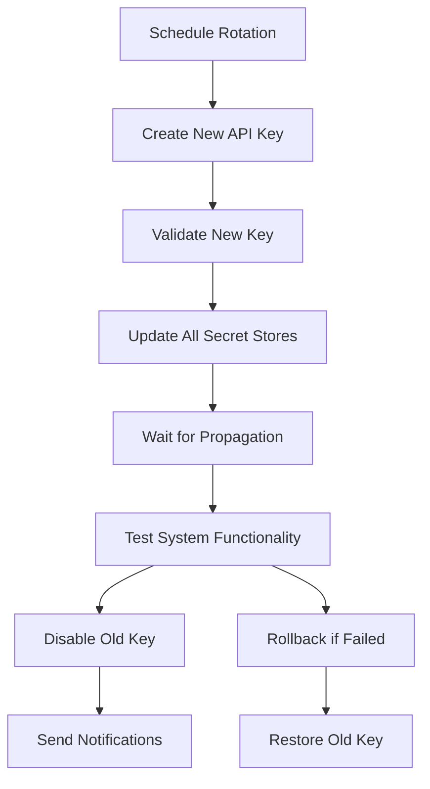

# 🔄 API Key Rotation Implementation Guide
## Automated Security for Trading Systems

### 🎯 **Why API Key Rotation is Critical**

**Security Benefits:**
- **Limits Exposure Window**: Compromised keys have limited lifespan
- **Prevents Long-Term Attacks**: Attackers can't use keys indefinitely
- **Compliance Requirements**: Many regulations require regular credential rotation
- **Reduces Impact of Breaches**: Old breaches become less valuable over time
- **Audit Trail**: Clear history of when keys were changed

**Real-World Impact:**
- **Binance 2019**: Long-lived API keys contributed to $40M hack
- **Coinbase 2021**: Attackers used stale credentials for months
- **Industry Standard**: 30-day rotation now considered best practice

---

## 🏗️ **Implementation Architecture**

### **System Components**

```python
# Core rotation system architecture
ROTATION_SYSTEM = {
    'APIKeyRotationSystem': 'Main orchestrator',
    'ExchangeAPIManager': 'Exchange-specific key operations', 
    'SecretRotationManager': 'Multi-platform secret updates',
    'RotationScheduler': 'Policy-based scheduling',
    'ValidationSystem': 'Pre/post rotation testing',
    'NotificationSystem': 'Alerts and reporting'
}
```

### **Rotation Flow**


---

## ⚙️ **Configuration Setup**

### **Environment Variables**
```bash
# ~/.env or environment configuration
export API_KEY_ROTATION_DAYS=30          # 30-day rotation cycle
export ROTATION_START_HOUR=2             # 2 AM maintenance window
export ROTATION_END_HOUR=4               # 4 AM maintenance window  
export EMERGENCY_ROTATION_ENABLED=true   # Allow emergency rotations
export MAX_FAILED_ATTEMPTS=5             # Trigger rotation after failures
export BACKUP_RETENTION_DAYS=90          # Keep backups for 90 days
export ROTATION_WEBHOOK_URL="https://alerts.company.com/webhook"
export SERVER_IP="192.168.1.100"         # For IP restrictions

# Last rotation tracking
export LAST_API_KEY_ROTATION="2024-01-15T00:00:00"
```

### **Docker Compose Configuration**
```yaml
version: '3.8'
services:
  trading-bot:
    image: trading-bot:latest
    environment:
      - API_KEY_ROTATION_DAYS=30
      - ROTATION_WEBHOOK_URL=https://alerts.company.com/webhook
      - EMERGENCY_ROTATION_ENABLED=true
    secrets:
      - binance_api_key
      - binance_secret
      - rotation_webhook_secret
    deploy:
      restart_policy:
        condition: on-failure
        delay: 5s
        max_attempts: 3

  rotation-scheduler:
    image: trading-bot:latest
    command: python3 api_key_rotation_system.py --check-schedule
    environment:
      - API_KEY_ROTATION_DAYS=30
    secrets:
      - binance_api_key
      - binance_secret
    deploy:
      mode: replicated
      replicas: 1
      restart_policy:
        condition: on-failure

secrets:
  binance_api_key:
    external: true
  binance_secret:
    external: true
  rotation_webhook_secret:
    external: true
```

### **Kubernetes Configuration**
```yaml
apiVersion: v1
kind: ConfigMap
metadata:
  name: rotation-config
data:
  API_KEY_ROTATION_DAYS: "30"
  ROTATION_START_HOUR: "2"
  ROTATION_END_HOUR: "4"
  EMERGENCY_ROTATION_ENABLED: "true"
  MAX_FAILED_ATTEMPTS: "5"
  BACKUP_RETENTION_DAYS: "90"

---
apiVersion: batch/v1
kind: CronJob
metadata:
  name: api-key-rotation-check
spec:
  schedule: "0 1 * * *"  # Check daily at 1 AM
  jobTemplate:
    spec:
      template:
        spec:
          containers:
          - name: rotation-checker
            image: trading-bot:latest
            command: 
            - python3
            - api_key_rotation_system.py
            - --check-schedule
            envFrom:
            - configMapRef:
                name: rotation-config
            - secretRef:
                name: trading-secrets
          restartPolicy: OnFailure

---
apiVersion: v1
kind: Secret
metadata:
  name: rotation-webhooks
stringData:
  webhook-url: "https://alerts.company.com/webhook"
```

---

## 🔄 **Rotation Policies**

### **Scheduled Rotation (Recommended)**
```python
ROTATION_POLICIES = {
    'production': {
        'interval_days': 30,        # Monthly rotation
        'maintenance_window': {
            'start_hour': 2,        # 2 AM
            'end_hour': 4,          # 4 AM
            'timezone': 'UTC'
        },
        'backup_retention': 90,     # 90 days
        'validation_timeout': 300   # 5 minutes
    },
    
    'high_security': {
        'interval_days': 14,        # Bi-weekly rotation
        'maintenance_window': {
            'start_hour': 1,
            'end_hour': 3,
            'timezone': 'UTC'
        },
        'backup_retention': 30,
        'validation_timeout': 180
    },
    
    'development': {
        'interval_days': 90,        # Quarterly rotation
        'immediate_rotation': True,  # No maintenance window
        'backup_retention': 30,
        'validation_timeout': 60
    }
}
```

### **Emergency Rotation Triggers**
```python
EMERGENCY_TRIGGERS = {
    'security_breach': {
        'description': 'Suspected compromise or breach',
        'immediate': True,
        'notification_priority': 'CRITICAL'
    },
    
    'failed_authentication': {
        'description': 'Multiple authentication failures',
        'threshold': 10,           # 10 failed attempts
        'timeframe': 300,          # within 5 minutes
        'immediate': True
    },
    
    'suspicious_activity': {
        'description': 'Unusual API usage patterns',
        'immediate': True,
        'notification_priority': 'HIGH'
    },
    
    'compliance_requirement': {
        'description': 'Regulatory or audit requirement',
        'immediate': False,        # Can wait for maintenance window
        'notification_priority': 'MEDIUM'
    }
}
```

---

## 🚀 **Deployment Examples**

### **Basic Rotation Setup**
```python
#!/usr/bin/env python3
"""
Basic API key rotation setup
Run this to initialize rotation system
"""

import asyncio
from api_key_rotation_system import APIKeyRotationSystem
from scalable_data_optimization_system import ScalableDataOptimizer

async def setup_rotation():
    """Setup rotation system"""
    
    # Initialize systems
    optimizer = ScalableDataOptimizer(environment="production")
    await optimizer.initialize()
    
    # Schedule initial rotation check
    rotation_id = await optimizer.secret_manager.schedule_key_rotation(
        exchange="binance",
        trigger="scheduled"
    )
    
    if rotation_id:
        print(f"✅ Rotation scheduled: {rotation_id}")
    else:
        print("❌ Failed to schedule rotation")
    
    await optimizer.cleanup()

if __name__ == "__main__":
    asyncio.run(setup_rotation())
```

### **Production Deployment Script**
```bash
#!/bin/bash
# deploy_with_rotation.sh

set -e

echo "🚀 Deploying trading bot with API key rotation"

# 1. Deploy main application
kubectl apply -f k8s/trading-bot-deployment.yaml

# 2. Setup rotation system
kubectl apply -f k8s/rotation-cronjob.yaml
kubectl apply -f k8s/rotation-config.yaml

# 3. Create initial secrets
kubectl create secret generic trading-secrets \
  --from-literal=binance-api-key="$BINANCE_API_KEY" \
  --from-literal=binance-secret="$BINANCE_SECRET" \
  --from-literal=rotation-webhook-url="$WEBHOOK_URL"

# 4. Test rotation system
python3 test_rotation_system.py

# 5. Schedule first rotation
python3 -c "
import asyncio
from api_key_rotation_system import APIKeyRotationSystem

async def main():
    system = APIKeyRotationSystem('production')
    rotations = await system.check_rotation_schedule()
    print(f'Scheduled {len(rotations)} rotations')

asyncio.run(main())
"

echo "✅ Deployment completed with rotation system"
```

### **AWS ECS with Secrets Manager**
```json
{
  "family": "trading-bot-with-rotation",
  "taskDefinition": {
    "containerDefinitions": [
      {
        "name": "trading-bot",
        "image": "your-account.dkr.ecr.region.amazonaws.com/trading-bot:latest",
        "environment": [
          {
            "name": "ENVIRONMENT",
            "value": "production"
          },
          {
            "name": "API_KEY_ROTATION_DAYS",
            "value": "30"
          }
        ],
        "secrets": [
          {
            "name": "BINANCE_API_KEY",
            "valueFrom": "arn:aws:secretsmanager:region:account:secret:trading-bot/binance-api-key"
          },
          {
            "name": "BINANCE_SECRET",
            "valueFrom": "arn:aws:secretsmanager:region:account:secret:trading-bot/binance-secret"
          }
        ]
      }
    ],
    "taskRoleArn": "arn:aws:iam::account:role/TradingBotTaskRole",
    "executionRoleArn": "arn:aws:iam::account:role/TradingBotExecutionRole"
  }
}
```

---

## 🔍 **Monitoring and Alerting**

### **Rotation Monitoring Script**
```python
#!/usr/bin/env python3
"""
Monitor API key rotation status
"""

import asyncio
import json
from datetime import datetime, timedelta
from api_key_rotation_system import APIKeyRotationSystem

async def monitor_rotations():
    """Monitor rotation status and send alerts"""
    
    system = APIKeyRotationSystem("production")
    
    # Check rotation schedule
    rotations_needed = await system.check_rotation_schedule()
    
    if rotations_needed:
        print(f"⚠️  {len(rotations_needed)} rotations needed")
        
        # Send alert
        alert = {
            'timestamp': datetime.now().isoformat(),
            'level': 'WARNING',
            'message': f'{len(rotations_needed)} API key rotations needed',
            'rotations': rotations_needed
        }
        
        # Send to monitoring system
        await send_alert(alert)
    
    # Check active rotations
    active_rotations = system.get_all_rotations()
    
    for rotation in active_rotations:
        if rotation.status.value == 'failed':
            print(f"❌ Failed rotation: {rotation.rotation_id}")
            
            alert = {
                'timestamp': datetime.now().isoformat(),
                'level': 'CRITICAL',
                'message': f'API key rotation failed: {rotation.rotation_id}',
                'error': rotation.error_message,
                'rotation_id': rotation.rotation_id
            }
            
            await send_alert(alert)

async def send_alert(alert):
    """Send alert to monitoring system"""
    import aiohttp
    
    webhook_url = os.environ.get('ROTATION_WEBHOOK_URL')
    if webhook_url:
        async with aiohttp.ClientSession() as session:
            async with session.post(webhook_url, json=alert) as response:
                if response.status == 200:
                    print(f"📧 Alert sent: {alert['message']}")
                else:
                    print(f"❌ Failed to send alert: {response.status}")

if __name__ == "__main__":
    asyncio.run(monitor_rotations())
```

### **Grafana Dashboard Query**
```promql
# API Key Rotation Metrics

# Days since last rotation
api_key_days_since_rotation{exchange="binance"}

# Rotation success rate
rate(api_key_rotation_success_total[24h]) / rate(api_key_rotation_attempts_total[24h])

# Failed rotations
increase(api_key_rotation_failed_total[1h])

# Rotation duration
histogram_quantile(0.95, api_key_rotation_duration_seconds_bucket)
```

---

## 📋 **Operational Procedures**

### **Daily Operations Checklist**
```bash
#!/bin/bash
# daily_rotation_check.sh

echo "🔍 Daily API Key Rotation Check - $(date)"

# 1. Check rotation schedule
python3 api_key_rotation_system.py --check-schedule

# 2. Verify rotation system health
python3 monitor_rotations.py

# 3. Check for failed rotations
python3 api_key_rotation_system.py --status failed

# 4. Validate current API keys
python3 validate_api_security.py

# 5. Clean up old backups
find /backups/api-keys -name "*.backup" -mtime +90 -delete

echo "✅ Daily rotation check completed"
```

### **Emergency Rotation Procedure**
```bash
#!/bin/bash
# emergency_rotation.sh

EXCHANGE=${1:-binance}
REASON=${2:-"Security incident"}

echo "🚨 EMERGENCY API KEY ROTATION"
echo "Exchange: $EXCHANGE"
echo "Reason: $REASON"

# 1. Trigger immediate rotation
python3 api_key_rotation_system.py --emergency-rotation $EXCHANGE

# 2. Monitor rotation progress
ROTATION_ID=$(python3 -c "
import asyncio
from api_key_rotation_system import APIKeyRotationSystem
async def main():
    system = APIKeyRotationSystem('production')
    rotations = system.get_all_rotations()
    if rotations:
        print(rotations[-1].rotation_id)
asyncio.run(main())
")

echo "Monitoring rotation: $ROTATION_ID"

# 3. Wait for completion (max 10 minutes)
for i in {1..60}; do
    STATUS=$(python3 api_key_rotation_system.py --status $ROTATION_ID | grep "Status:" | cut -d: -f2 | tr -d ' ')
    
    if [ "$STATUS" = "completed" ]; then
        echo "✅ Emergency rotation completed successfully"
        break
    elif [ "$STATUS" = "failed" ]; then
        echo "❌ Emergency rotation failed"
        exit 1
    fi
    
    echo "⏳ Rotation in progress... ($i/60)"
    sleep 10
done

echo "📧 Sending emergency rotation notification"
# Send notification to incident response team
```

### **Rotation Rollback Procedure**
```python
#!/usr/bin/env python3
"""
Emergency rollback procedure
Use if rotation causes system issues
"""

import asyncio
from api_key_rotation_system import APIKeyRotationSystem

async def emergency_rollback(rotation_id: str):
    """Rollback a failed rotation"""
    
    system = APIKeyRotationSystem("production")
    
    rotation = system.get_rotation_status(rotation_id)
    if not rotation:
        print(f"❌ Rotation {rotation_id} not found")
        return
    
    if rotation.rollback_available:
        print(f"🔄 Rolling back rotation {rotation_id}")
        success = await system._rollback_rotation(rotation_id)
        
        if success:
            print("✅ Rollback completed successfully")
        else:
            print("❌ Rollback failed - manual intervention required")
    else:
        print("❌ Rollback not available for this rotation")

if __name__ == "__main__":
    import sys
    if len(sys.argv) > 1:
        asyncio.run(emergency_rollback(sys.argv[1]))
    else:
        print("Usage: python3 rollback_rotation.py <rotation_id>")
```

---

## 🔒 **Security Best Practices**

### **Rotation Security Checklist**
- [ ] **Backup Strategy**: Always backup old keys before rotation
- [ ] **Validation Testing**: Test new keys before disabling old ones
- [ ] **Rollback Plan**: Ensure ability to revert if issues occur
- [ ] **Access Logging**: Log all rotation activities
- [ ] **Notification System**: Alert on rotation events
- [ ] **Maintenance Windows**: Rotate during low-activity periods
- [ ] **Multiple Environments**: Test rotation in staging first
- [ ] **Documentation**: Keep rotation procedures updated

### **Common Pitfalls to Avoid**
```python
ROTATION_PITFALLS = {
    'simultaneous_rotation': {
        'issue': 'Rotating multiple exchanges at once',
        'risk': 'Total system downtime if issues occur',
        'solution': 'Stagger rotations by 24-48 hours'
    },
    
    'insufficient_testing': {
        'issue': 'Not validating new keys thoroughly',
        'risk': 'System failures after rotation',
        'solution': 'Comprehensive validation before old key disable'
    },
    
    'no_rollback_plan': {
        'issue': 'No way to revert failed rotation',
        'risk': 'Extended downtime during issues',
        'solution': 'Always maintain rollback capability'
    },
    
    'poor_timing': {
        'issue': 'Rotating during market volatility',
        'risk': 'Missing trading opportunities',
        'solution': 'Schedule during low-activity periods'
    }
}
```

---

## 📈 **Success Metrics**

### **Key Performance Indicators**
```python
ROTATION_METRICS = {
    'success_rate': {
        'target': '99.5%',
        'measurement': 'Successful rotations / Total attempts'
    },
    
    'rotation_duration': {
        'target': '< 5 minutes',
        'measurement': 'Time from start to completion'
    },
    
    'downtime_during_rotation': {
        'target': '< 30 seconds',
        'measurement': 'Trading system unavailable time'
    },
    
    'compliance_rate': {
        'target': '100%',
        'measurement': 'On-time rotations / Scheduled rotations'
    },
    
    'rollback_rate': {
        'target': '< 1%',
        'measurement': 'Rollbacks required / Total rotations'
    }
}
```

**🎯 With this comprehensive rotation system, your trading bot now has enterprise-grade API key security that automatically maintains the principle of least privilege while ensuring zero-downtime operations.** 