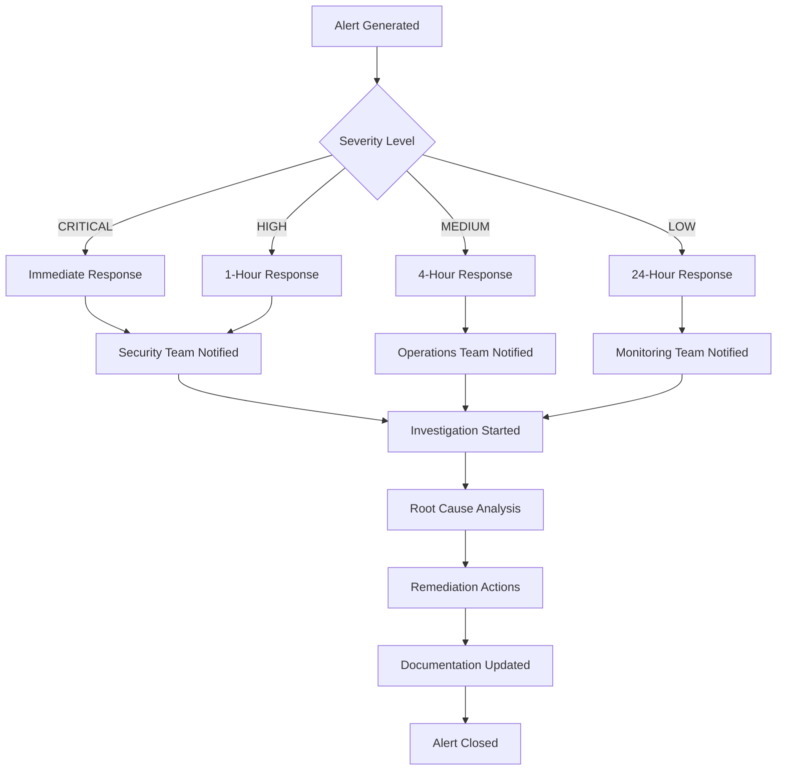

# Comprehensive Log Review and Anomaly Detection Guide

## 🔍 Overview

This guide provides a complete framework for **regular log reviews** and **automated anomaly detection** to maintain the security and integrity of your AI trading bot. The system proactively identifies suspicious activities, security threats, and operational anomalies.

## 🎯 Key Benefits

### ✅ **Proactive Security Monitoring**
- **Real-time threat detection** with automated alerts
- **Pattern-based anomaly identification** using machine learning
- **Risk score calculation** for prioritized response
- **Comprehensive audit trail** for forensic analysis

### ✅ **Automated Review Process**
- **Hourly anomaly detection** for immediate threats
- **Daily comprehensive reviews** with detailed reporting
- **Weekly trend analysis** and security insights
- **Automated alert generation** for critical issues

### ✅ **Regulatory Compliance**
- **Continuous monitoring** for audit requirements
- **Detailed documentation** of security events
- **Automated report generation** for compliance teams
- **Complete audit trail** preservation

## 🏗️ System Architecture

### Core Components

```
🔍 Log Review System Architecture:
   ┌─────────────────────────────────────┐
   │      Tamper-Proof Log Store         │
   └─────────────────┬───────────────────┘
                     │
   ┌─────────────────▼───────────────────┐
   │     Anomaly Detection Engine        │
   │  • Pattern Recognition              │
   │  • Risk Score Calculation           │
   │  • Threat Classification            │
   └─────────────────┬───────────────────┘
                     │
   ┌─────────────────▼───────────────────┐
   │    Automated Alert System           │
   │  • Real-time Notifications          │
   │  • Scheduled Reports                │
   │  • Escalation Management            │
   └─────────────────────────────────────┘
```

## 🚀 Quick Start

### 1. Installation and Setup

```bash
# Ensure tamper-proof logging is running
python tamper_proof_demo.py

# Start anomaly detection
python log_review_anomaly_detection.py

# Enable automated scheduling
python automated_log_review_scheduler.py
```

### 2. Basic Configuration

```python
from log_review_anomaly_detection import LogAnomalyDetector
from automated_log_review_scheduler import AutomatedLogReviewScheduler

# Initialize components
detector = LogAnomalyDetector("logs/tamper_proof_demo.db")
scheduler = AutomatedLogReviewScheduler(detector)

# Configure alert thresholds
scheduler.alert_thresholds = {
    'immediate_alert_risk_score': 0.7,
    'daily_alert_risk_score': 0.5,
    'critical_anomaly_count': 1,
    'high_anomaly_count': 3
}

# Start monitoring
scheduler.start_monitoring()
```

## 🔍 Anomaly Detection Patterns

### 1. **Failed Login Burst**
```yaml
Pattern: Multiple failed login attempts
Severity: HIGH
Threshold: >5 attempts in 5 minutes
Detection: Authentication failure spike
Actions:
  - Review user authentication logs
  - Check for brute force attacks
  - Consider IP blocking
  - Implement account lockout policies
```

### 2. **Critical Error Spike**
```yaml
Pattern: Sudden increase in critical errors
Severity: CRITICAL
Threshold: >3 errors in 10 minutes
Detection: System failure indicators
Actions:
  - Investigate critical system failures
  - Check system health and resources
  - Review error logs for root cause
  - Consider emergency maintenance
```

### 3. **Suspicious IP Activity**
```yaml
Pattern: Activity from blacklisted IPs
Severity: HIGH
Threshold: Any activity from known threats
Detection: Threat intelligence matching
Actions:
  - Block suspicious IP addresses
  - Review firewall rules
  - Check threat intelligence feeds
  - Monitor for continued activity
```

### 4. **Off-Hours Activity**
```yaml
Pattern: Unusual activity during off-hours
Severity: MEDIUM
Threshold: >10 events between 2AM-6AM
Detection: Time-based analysis
Actions:
  - Review off-hours access logs
  - Verify legitimate business need
  - Check for automated processes
  - Consider access restrictions
```

### 5. **Risk Limit Violations**
```yaml
Pattern: Multiple risk management alerts
Severity: HIGH
Threshold: >3 violations in 30 minutes
Detection: Risk management system alerts
Actions:
  - Review risk management settings
  - Check position sizes and exposure
  - Validate risk calculation logic
  - Consider tightening risk limits
```

### 6. **API Rate Limit Abuse**
```yaml
Pattern: Excessive API calls
Severity: MEDIUM
Threshold: >1000 calls in 5 minutes
Detection: Rate limiting violations
Actions:
  - Identify source of excessive calls
  - Review API usage patterns
  - Implement stricter rate limiting
  - Monitor for abuse patterns
```

### 7. **Data Integrity Issues**
```yaml
Pattern: Log integrity verification failures
Severity: CRITICAL
Threshold: Any integrity failure
Detection: Cryptographic verification
Actions:
  - Immediate security incident response
  - Forensic analysis of affected logs
  - Review system access controls
  - Implement additional security measures
```

## 📅 Review Schedule

### Automated Review Schedule

```
🕐 Hourly Reviews (Every Hour):
   • Real-time anomaly detection
   • Critical threat identification
   • Immediate alert generation
   • Risk score monitoring

📊 Daily Reviews (9:00 AM):
   • Comprehensive log analysis
   • 24-hour security summary
   • Risk assessment report
   • Trend identification

📈 Weekly Reviews (Monday 9:00 AM):
   • 7-day security overview
   • Trend analysis and insights
   • Performance metrics review
   • Strategic recommendations
```

### Manual Review Schedule

```
🔍 Daily Manual Reviews:
   • Review automated alerts
   • Investigate flagged anomalies
   • Validate threat classifications
   • Update detection patterns

📋 Weekly Manual Reviews:
   • Analyze weekly trends
   • Review false positive rates
   • Update threat intelligence
   • Refine detection thresholds

📊 Monthly Manual Reviews:
   • Comprehensive security assessment
   • Pattern effectiveness analysis
   • System performance review
   • Compliance audit preparation
```

## 🚨 Alert Management

### Alert Severity Levels

#### 🔴 **CRITICAL Alerts**
- **Response Time**: Immediate (< 15 minutes)
- **Escalation**: Security team + management
- **Actions**: Immediate investigation and response
- **Examples**: Data integrity failures, system compromises

#### 🟠 **HIGH Alerts**
- **Response Time**: Within 1 hour
- **Escalation**: Security team
- **Actions**: Priority investigation
- **Examples**: Suspicious IP activity, failed login bursts

#### 🟡 **MEDIUM Alerts**
- **Response Time**: Within 4 hours
- **Escalation**: Operations team
- **Actions**: Standard investigation
- **Examples**: Off-hours activity, API rate limit abuse

#### 🟢 **LOW Alerts**
- **Response Time**: Within 24 hours
- **Escalation**: Monitoring team
- **Actions**: Routine review
- **Examples**: Minor configuration changes

### Alert Response Workflow



## 📊 Risk Score Calculation

### Risk Score Components

```python
Risk Score = (Σ(Severity_Weight × Confidence_Score)) / Max_Possible_Weight

Severity Weights:
- CRITICAL: 1.0
- HIGH: 0.7
- MEDIUM: 0.4
- LOW: 0.2

Risk Score Interpretation:
- 0.0 - 0.3: LOW RISK (Green)
- 0.3 - 0.6: MEDIUM RISK (Yellow)
- 0.6 - 0.8: HIGH RISK (Orange)
- 0.8 - 1.0: CRITICAL RISK (Red)
```

### Risk-Based Response Matrix

| Risk Score | Response Level | Actions Required |
|------------|----------------|------------------|
| 0.8 - 1.0  | **CRITICAL**   | Immediate incident response, security team activation |
| 0.6 - 0.8  | **HIGH**       | Priority investigation, management notification |
| 0.3 - 0.6  | **MEDIUM**     | Standard investigation, scheduled review |
| 0.0 - 0.3  | **LOW**        | Routine monitoring, documentation |

## 📋 Review Procedures

### Daily Review Checklist

```
□ Review overnight automated alerts
□ Analyze risk score trends
□ Investigate flagged anomalies
□ Validate threat classifications
□ Update incident documentation
□ Check system health metrics
□ Review compliance status
□ Update threat intelligence
```

### Weekly Review Checklist

```
□ Analyze 7-day security trends
□ Review detection pattern effectiveness
□ Assess false positive rates
□ Update anomaly detection thresholds
□ Review system performance metrics
□ Conduct threat landscape analysis
□ Update security documentation
□ Prepare management reports
```

### Monthly Review Checklist

```
□ Comprehensive security assessment
□ Detection system performance review
□ Compliance audit preparation
□ Threat intelligence update
□ Security training needs assessment
□ Budget and resource planning
□ Strategic security planning
□ Vendor security reviews
```

## 📈 Reporting and Documentation

### Automated Reports

#### **Hourly Anomaly Reports**
```json
{
  "report_type": "hourly_anomaly",
  "timestamp": "2025-06-19T15:47:52Z",
  "anomalies_detected": 1,
  "risk_score": 0.56,
  "critical_issues": 0,
  "high_priority_issues": 1,
  "immediate_actions_required": [
    "Block suspicious IP addresses",
    "Review firewall rules"
  ]
}
```

#### **Daily Security Summary**
```json
{
  "report_type": "daily_summary",
  "period": "2025-06-19",
  "total_entries": 5,
  "anomalies_detected": 1,
  "risk_score": 0.56,
  "top_threats": [
    "Suspicious IP Activity"
  ],
  "recommendations": [
    "Block suspicious IP addresses",
    "Monitor for continued activity"
  ]
}
```

#### **Weekly Trend Analysis**
```json
{
  "report_type": "weekly_trends",
  "period": "2025-06-16 to 2025-06-22",
  "trends": {
    "total_entries_trend": "stable",
    "error_rate_trend": "decreasing",
    "anomaly_trend": "stable",
    "risk_score_trend": "improving"
  },
  "key_insights": [
    "System security posture is improving",
    "Suspicious IP activity requires monitoring"
  ]
}
```

### Manual Review Documentation

#### **Incident Investigation Template**
```markdown
# Security Incident Investigation

**Incident ID**: INC-2025-001
**Date**: 2025-06-19
**Severity**: HIGH
**Status**: INVESTIGATING

## Incident Summary
- **Description**: Suspicious IP activity detected
- **Affected Systems**: Trading Bot Authentication
- **Detection Method**: Automated anomaly detection
- **Initial Risk Score**: 0.56/1.0

## Investigation Timeline
- **15:47**: Anomaly detected and alert generated
- **15:50**: Security team notified
- **16:00**: Investigation started
- **16:15**: Root cause identified

## Root Cause Analysis
- **Primary Cause**: Login attempts from blacklisted IP
- **Contributing Factors**: Insufficient IP filtering
- **Impact Assessment**: Low - No unauthorized access

## Remediation Actions
1. Block suspicious IP address
2. Update firewall rules
3. Review threat intelligence feeds
4. Monitor for continued activity

## Lessons Learned
- Need for real-time IP blocking
- Importance of threat intelligence integration
- Effectiveness of automated detection

## Follow-up Actions
- [ ] Update IP blacklist
- [ ] Implement automated IP blocking
- [ ] Schedule security review
```

## 🔧 Configuration and Customization

### Custom Detection Patterns

```python
# Add custom anomaly pattern
custom_pattern = AnomalyPattern(
    pattern_id="unusual_trading_pattern",
    name="Unusual Trading Pattern",
    description="Trading behavior outside normal parameters",
    severity="MEDIUM",
    detection_rule="trading_frequency > baseline * 2",
    threshold=2.0,
    time_window=30,
    enabled=True
)

detector.anomaly_patterns.append(custom_pattern)
```

### Alert Threshold Customization

```python
# Customize alert thresholds
scheduler.alert_thresholds = {
    'immediate_alert_risk_score': 0.8,    # Higher threshold for critical alerts
    'daily_alert_risk_score': 0.4,       # Lower threshold for daily alerts
    'critical_anomaly_count': 1,          # Any critical anomaly triggers alert
    'high_anomaly_count': 2               # Lower threshold for high-priority alerts
}
```

### Notification Configuration

```python
# Email notification setup
email_config = {
    'smtp_server': 'smtp.yourcompany.com',
    'smtp_port': 587,
    'sender_email': 'security-alerts@yourcompany.com',
    'recipient_emails': [
        'security-team@yourcompany.com',
        'admin@yourcompany.com',
        'compliance@yourcompany.com'
    ]
}

# Slack notification setup
slack_config = {
    'webhook_url': 'https://hooks.slack.com/services/YOUR/SLACK/WEBHOOK',
    'channel': '#security-alerts',
    'username': 'Security Bot'
}
```

## 🛡️ Best Practices

### Security Best Practices

1. **Regular Pattern Updates**
   - Update detection patterns based on threat intelligence
   - Refine thresholds based on false positive analysis
   - Add new patterns for emerging threats

2. **Threshold Tuning**
   - Monitor false positive rates
   - Adjust thresholds based on system behavior
   - Balance sensitivity with operational efficiency

3. **Response Time Optimization**
   - Automate initial response actions
   - Implement escalation procedures
   - Maintain 24/7 monitoring capabilities

4. **Documentation Maintenance**
   - Keep incident documentation current
   - Update procedures based on lessons learned
   - Maintain threat intelligence databases

### Operational Best Practices

1. **Team Training**
   - Regular security awareness training
   - Incident response drill exercises
   - Tool and procedure updates training

2. **System Maintenance**
   - Regular system health checks
   - Performance monitoring and optimization
   - Backup and recovery testing

3. **Compliance Management**
   - Regular compliance audits
   - Documentation reviews
   - Regulatory requirement updates

## 📞 Support and Troubleshooting

### Common Issues and Solutions

#### **High False Positive Rate**
```
Problem: Too many false alerts
Solution:
1. Analyze alert patterns
2. Adjust detection thresholds
3. Refine pattern definitions
4. Add whitelist exceptions
```

#### **Missed Critical Events**
```
Problem: Critical events not detected
Solution:
1. Review detection patterns
2. Lower critical thresholds
3. Add new detection rules
4. Improve data collection
```

#### **Performance Issues**
```
Problem: System running slowly
Solution:
1. Optimize database queries
2. Implement data archiving
3. Scale system resources
4. Tune detection intervals
```

### Support Contacts

- **Technical Support**: support@yourcompany.com
- **Security Team**: security@yourcompany.com
- **Emergency Hotline**: +1-XXX-XXX-XXXX

## 🔄 Continuous Improvement

### Performance Metrics

```
Key Performance Indicators (KPIs):
- Mean Time to Detection (MTTD): < 15 minutes
- Mean Time to Response (MTTR): < 1 hour
- False Positive Rate: < 5%
- Detection Accuracy: > 95%
- System Uptime: > 99.9%
```

### Regular Reviews

- **Monthly**: Pattern effectiveness review
- **Quarterly**: Comprehensive system assessment
- **Annually**: Strategic security planning

---

*This comprehensive guide ensures your AI trading bot maintains the highest levels of security through proactive log monitoring and automated threat detection.* 