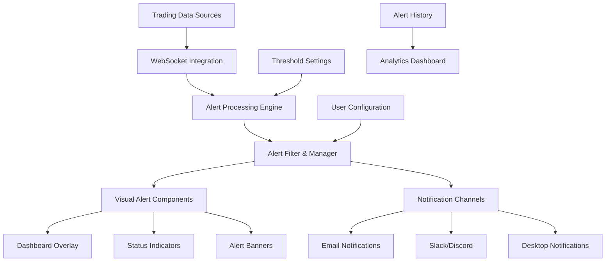

# 🚨 Visual Alerts & Notifications System

## Complete Guide to Real-Time Trading Dashboard Alerts

### 📋 Table of Contents
1. [Overview](#overview)
2. [System Architecture](#system-architecture)
3. [Alert Types & Severity Levels](#alert-types--severity-levels)
4. [Critical Event Monitoring](#critical-event-monitoring)
5. [Visual Components](#visual-components)
6. [Configuration & Customization](#configuration--customization)
7. [Integration Guide](#integration-guide)
8. [Usage Examples](#usage-examples)
9. [Best Practices](#best-practices)
10. [Troubleshooting](#troubleshooting)

---

## Overview

The **Visual Alerts & Notifications System** provides comprehensive real-time monitoring and alerting for critical trading events. It integrates seamlessly with your trading dashboard to deliver immediate visual feedback for:

- 💰 **Portfolio Events**: Low balance, high losses, exceptional gains
- 📉 **Risk Management**: Drawdown levels, exposure limits, risk thresholds
- 🌍 **Market Movements**: Significant price changes, volatility spikes
- ⚙️ **System Health**: CPU/memory usage, API latency, connectivity
- 🤖 **Trading Signals**: AI confidence levels, conflicting signals
- 📊 **Performance**: System metrics, optimization recommendations

### 🎯 Key Features

- **Multi-Level Severity System**: Info, Success, Warning, Danger, Critical
- **Real-Time WebSocket Integration**: Instant alert triggering
- **Smart Filtering**: Prevents alert spam with cooldown periods
- **Visual Indicators**: Flash alerts, color coding, persistent notifications
- **Configurable Thresholds**: Customizable alert conditions
- **Multi-Channel Support**: Dashboard, email, Slack, Discord
- **Alert History**: Complete tracking and analytics
- **Auto-Dismissal**: Intelligent alert management

---

## System Architecture



### 🏗️ Core Components

1. **VisualAlertsSystem**: Main orchestration class
2. **AlertFilter**: Smart filtering and cooldown management
3. **WebSocket Integration**: Real-time data processing
4. **Alert Components**: Visual dashboard elements
5. **Notification Channels**: Multi-channel alert delivery

---

## Alert Types & Severity Levels

### 📊 Severity Levels

| Level | Icon | Color | Description | Auto-Dismiss | Sound |
|-------|------|-------|-------------|--------------|-------|
| **INFO** | ℹ️ | Blue | General information | ✅ Yes | ❌ No |
| **SUCCESS** | ✅ | Green | Positive events | ✅ Yes | ❌ No |
| **WARNING** | ⚠️ | Orange | Attention needed | ❌ No | ✅ Yes |
| **DANGER** | 🚨 | Red | Action required | ❌ No | ✅ Yes |
| **CRITICAL** | 🔥 | Dark Red | Immediate action | ❌ No | ✅ Yes |

### 🏷️ Alert Categories

#### 💼 Portfolio Alerts
- **Low Balance Warning**: Portfolio below $1,000
- **Critical Balance**: Portfolio below $500
- **High Daily Loss**: Daily P&L < -5% (Warning), < -10% (Critical)
- **Exceptional Performance**: Daily P&L > +5%

#### 🛡️ Risk Management Alerts
- **Drawdown Warning**: Portfolio drawdown > 10%
- **Critical Drawdown**: Portfolio drawdown > 20%
- **Emergency Drawdown**: Portfolio drawdown > 30%
- **Position Size Alert**: Single position > 50% of portfolio

#### 🌍 Market Movement Alerts
- **Significant Movement**: Price change > 5%
- **Major Movement**: Price change > 10%
- **Extreme Movement**: Price change > 20%
- **Volume Spike**: Trading volume > 2x normal

#### ⚙️ System Health Alerts
- **High CPU Usage**: CPU > 80% (Warning), > 95% (Critical)
- **High Memory Usage**: Memory > 85% (Warning), > 95% (Critical)
- **API Latency**: Response time > 2s (Warning), > 5s (Critical)
- **Connection Issues**: WebSocket disconnections

#### 🤖 Trading Signal Alerts
- **High Confidence Signal**: AI confidence > 80%
- **Very High Confidence**: AI confidence > 90%
- **Low Confidence Warning**: AI confidence < 60%
- **Conflicting Signals**: Multiple models disagree

---

## Critical Event Monitoring

### 🚨 Emergency Scenarios

The system monitors for critical scenarios that require immediate attention:

#### 1. **Portfolio Emergency**
```python
# Triggered when:
- Portfolio balance < $500 (Critical threshold)
- Daily loss > 10% (Critical threshold)
- Drawdown > 30% (Emergency threshold)

# Response:
- Persistent critical alert
- Flash animation
- Sound notification
- Immediate dashboard banner
```

#### 2. **Market Crisis**
```python
# Triggered when:
- BTC/ETH movement > 20% in 24h
- Multiple major coins moving > 15%
- Volume spike > 5x normal

# Response:
- Market alert banner
- All active positions reviewed
- Risk assessment triggered
```

#### 3. **System Failure**
```python
# Triggered when:
- CPU usage > 95% for 5+ minutes
- Memory usage > 95%
- API failures > 50% in 10 minutes
- WebSocket disconnected > 30 seconds

# Response:
- System health alert
- Performance monitoring activated
- Backup systems engaged
```

### 📊 Real-Time Monitoring Thresholds

| Metric | Warning | Critical | Emergency |
|--------|---------|----------|-----------|
| Portfolio Balance | $1,000 | $500 | $100 |
| Daily P&L Loss | -5% | -10% | -15% |
| Portfolio Drawdown | 10% | 20% | 30% |
| BTC Price Movement | 5% | 10% | 20% |
| CPU Usage | 80% | 95% | 98% |
| Memory Usage | 85% | 95% | 98% |
| API Response Time | 2s | 5s | 10s |

---

## Visual Components

### 🎨 Dashboard Integration

#### 1. **Alert Overlay**
```html
<!-- Positioned overlay for non-intrusive alerts -->
<div class="alerts-overlay" style="position: fixed; top: 20px; right: 20px;">
    <!-- Individual alert cards appear here -->
</div>
```

#### 2. **Status Badge**
```html
<!-- System status indicator -->
<badge class="alert-status-badge">
    🔥 3 Critical | ⚠️ 5 Warnings | ✅ System OK
</badge>
```

#### 3. **Critical Alert Banner**
```html
<!-- Full-width banner for emergency alerts -->
<div class="critical-alert-banner">
    🚨 EMERGENCY: Portfolio drawdown exceeded 30% - Immediate action required
</div>
```

#### 4. **Metric Alert Indicators**
```html
<!-- Small indicators next to metrics -->
<div class="metric-display">
    Portfolio: $850 <badge color="danger">Low Balance</badge>
</div>
```

### 🎭 Visual Effects

#### Flash Alerts
```css
.flash-alert {
    animation: flash 1s infinite;
}

@keyframes flash {
    0%, 50% { opacity: 1; }
    25%, 75% { opacity: 0.5; }
}
```

#### Color Coding
- 🔵 **Info**: `#17a2b8` (Blue)
- 🟢 **Success**: `#28a745` (Green)  
- 🟠 **Warning**: `#ffc107` (Orange)
- 🔴 **Danger**: `#dc3545` (Red)
- 🟣 **Critical**: `#6f42c1` (Purple)

#### Border Emphasis
```css
.alert-critical {
    border-left: 5px solid #dc3545;
    box-shadow: 0 0 10px rgba(220, 53, 69, 0.3);
}
```

---

## Configuration & Customization

### ⚙️ Alert Thresholds Configuration

```python
# Configure custom thresholds
alert_thresholds = {
    'portfolio_balance': {
        'low_balance_warning': 2000,    # Increase to $2,000
        'low_balance_critical': 1000,   # Increase to $1,000
    },
    'daily_pnl': {
        'loss_warning': -0.03,          # More sensitive: -3%
        'loss_critical': -0.07,         # More sensitive: -7%
        'gain_celebration': 0.03,       # Lower threshold: +3%
    },
    'drawdown': {
        'warning_level': 0.08,          # More sensitive: 8%
        'critical_level': 0.15,         # More sensitive: 15%
        'emergency_level': 0.25,        # More sensitive: 25%
    }
}
```

### 🔔 Notification Settings

```python
notification_settings = {
    'enable_sound': True,
    'enable_flash': True,
    'enable_desktop_notifications': True,
    'auto_dismiss_info': True,
    'auto_dismiss_success': True,
    'auto_dismiss_warning': False,      # Keep warnings visible
    'auto_dismiss_danger': False,       # Keep danger alerts visible
    'auto_dismiss_critical': False,     # Keep critical alerts visible
    'max_concurrent_alerts': 3,         # Limit to 3 visible alerts
    'alert_position': 'top-right',      # Position on screen
    'theme': 'dark'                     # Dark theme
}
```

### 📢 Multi-Channel Configuration

```python
# Email notifications
email_config = {
    'enabled': True,
    'smtp_server': 'smtp.gmail.com',
    'smtp_port': 587,
    'username': 'your-email@gmail.com',
    'password': 'your-app-password',
    'to_emails': ['trader1@company.com', 'trader2@company.com']
}

# Slack notifications
slack_config = {
    'enabled': True,
    'webhook_url': 'https://hooks.slack.com/services/YOUR/WEBHOOK/URL',
    'channel': '#trading-alerts',
    'username': 'Trading Bot'
}

# Discord notifications
discord_config = {
    'enabled': True,
    'webhook_url': 'https://discord.com/api/webhooks/YOUR/WEBHOOK/URL',
    'username': 'Trading Bot'
}
```

---

## Integration Guide

### 🔌 WebSocket Integration

```python
# Setup WebSocket data processing
def setup_websocket_alerts(alerts_system):
    """Integrate alerts with WebSocket data stream"""
    
    @websocket_callback
    def process_trading_data(data):
        # Portfolio monitoring
        if 'portfolio_value' in data:
            portfolio_value = data['portfolio_value']
            if portfolio_value < 1000:
                alerts_system.add_alert(
                    title="Low Portfolio Balance",
                    message=f"Portfolio balance: ${portfolio_value:,.2f}",
                    severity=AlertSeverity.WARNING,
                    category=AlertCategory.PORTFOLIO,
                    value=portfolio_value,
                    threshold=1000
                )
        
        # Market movement monitoring
        if 'btc_24h_change' in data:
            btc_change = data['btc_24h_change']
            if abs(btc_change) > 0.10:  # 10% movement
                alerts_system.add_alert(
                    title="Major Market Movement",
                    message=f"BTC moved {btc_change:+.2%} in 24h",
                    severity=AlertSeverity.WARNING,
                    category=AlertCategory.MARKET,
                    symbol="BTCUSDT",
                    value=btc_change
                )
```

### 📊 Dashboard Integration

```python
# Add alerts to existing dashboard
def integrate_with_dashboard(app, alerts_system):
    """Integrate alerts with existing Dash dashboard"""
    
    # Add alert components to layout
    existing_layout = app.layout
    app.layout = html.Div([
        alerts_system.create_alerts_layout(),  # Add alerts overlay
        existing_layout                        # Keep existing content
    ])
    
    # Setup alert callbacks
    alerts_system.setup_alert_callbacks()
    
    # Add alert status to header
    @app.callback(
        Output('header-alert-status', 'children'),
        [Input('alert-monitor-interval', 'n_intervals')]
    )
    def update_header_alerts(n_intervals):
        summary = alerts_system.get_alert_summary()
        if summary['critical'] > 0:
            return dbc.Badge(f"🔥 {summary['critical']} Critical", color="danger")
        elif summary['danger'] > 0:
            return dbc.Badge(f"🚨 {summary['danger']} Alerts", color="warning")
        else:
            return dbc.Badge("✅ System OK", color="success")
```

### 🤖 AI/ML Integration

```python
# Integrate with AI trading signals
def setup_ai_signal_alerts(alerts_system, ai_system):
    """Setup alerts for AI trading signals"""
    
    @ai_system.on_signal_generated
    def handle_new_signal(signal):
        confidence = signal.confidence
        symbol = signal.symbol
        direction = signal.direction
        
        # High confidence signals
        if confidence >= 0.9:
            alerts_system.add_alert(
                title="Very High Confidence Signal",
                message=f"AI generated {direction} signal for {symbol}",
                severity=AlertSeverity.SUCCESS,
                category=AlertCategory.TRADING,
                symbol=symbol,
                value=confidence,
                threshold=0.9
            )
        
        # Low confidence warnings
        elif confidence < 0.6:
            alerts_system.add_alert(
                title="Low Confidence Warning",
                message=f"AI signal confidence below threshold: {confidence:.1%}",
                severity=AlertSeverity.WARNING,
                category=AlertCategory.TRADING,
                symbol=symbol,
                value=confidence,
                threshold=0.6
            )
```

---

## Usage Examples

### 🚀 Basic Setup

```python
import dash
from visual_alerts_system import VisualAlertsSystem, AlertSeverity, AlertCategory

# Create Dash app
app = dash.Dash(__name__)

# Initialize alerts system
alerts_system = VisualAlertsSystem(app)

# Create layout with alerts
app.layout = html.Div([
    # Your existing dashboard content
    html.H1("Trading Dashboard"),
    
    # Add alerts overlay
    alerts_system.create_alerts_layout()
])

# Setup callbacks
alerts_system.setup_alert_callbacks()

# Start monitoring
alerts_system.start_monitoring()
```

### 📊 Custom Alert Creation

```python
# Portfolio balance alert
alerts_system.add_alert(
    title="Portfolio Balance Warning",
    message="Portfolio balance below $1,000 threshold",
    severity=AlertSeverity.WARNING,
    category=AlertCategory.PORTFOLIO,
    value=850,
    threshold=1000,
    auto_dismiss=False  # Keep visible until manually dismissed
)

# Market movement alert
alerts_system.add_alert(
    title="Extreme Market Movement",
    message="Bitcoin moved -15.5% in the last 4 hours",
    severity=AlertSeverity.DANGER,
    category=AlertCategory.MARKET,
    symbol="BTCUSDT",
    value=-0.155,
    flash_alert=True,   # Enable flash animation
    sound_alert=True    # Enable sound notification
)

# System performance alert
alerts_system.add_alert(
    title="Critical System Performance",
    message="CPU usage critically high at 96%",
    severity=AlertSeverity.CRITICAL,
    category=AlertCategory.SYSTEM,
    value=96,
    threshold=95,
    persistent=True     # Requires manual dismissal
)
```

### 🔄 Real-Time Monitoring

```python
# Setup real-time monitoring with WebSocket
def setup_realtime_monitoring():
    """Setup real-time alert monitoring"""
    
    # Monitor portfolio metrics
    @websocket.on('portfolio_update')
    def handle_portfolio_update(data):
        portfolio_value = data['value']
        daily_pnl = data['daily_pnl_percent']
        
        # Check portfolio balance
        if portfolio_value < 500:
            alerts_system.add_alert(
                title="CRITICAL: Portfolio Balance",
                message=f"Portfolio critically low: ${portfolio_value:,.2f}",
                severity=AlertSeverity.CRITICAL,
                category=AlertCategory.PORTFOLIO,
                persistent=True
            )
        
        # Check daily performance
        if daily_pnl < -0.10:
            alerts_system.add_alert(
                title="High Daily Loss",
                message=f"Daily P&L: {daily_pnl:.2%}",
                severity=AlertSeverity.DANGER,
                category=AlertCategory.PORTFOLIO
            )
    
    # Monitor market data
    @websocket.on('market_update')
    def handle_market_update(data):
        for symbol, info in data.items():
            price_change = info['24h_change_percent']
            
            if abs(price_change) > 0.15:  # 15% movement
                alerts_system.add_alert(
                    title=f"Extreme Movement: {symbol}",
                    message=f"{symbol} moved {price_change:+.2%} in 24h",
                    severity=AlertSeverity.WARNING,
                    category=AlertCategory.MARKET,
                    symbol=symbol,
                    value=price_change
                )
```

### 📈 Performance Monitoring

```python
# Setup system performance monitoring
def setup_performance_monitoring():
    """Monitor system performance and generate alerts"""
    
    import psutil
    import time
    import threading
    
    def monitor_system():
        while True:
            # Get system metrics
            cpu_percent = psutil.cpu_percent(interval=1)
            memory_percent = psutil.virtual_memory().percent
            
            # CPU alerts
            if cpu_percent > 95:
                alerts_system.add_alert(
                    title="Critical CPU Usage",
                    message=f"CPU usage: {cpu_percent:.1f}%",
                    severity=AlertSeverity.CRITICAL,
                    category=AlertCategory.SYSTEM,
                    value=cpu_percent,
                    threshold=95
                )
            elif cpu_percent > 80:
                alerts_system.add_alert(
                    title="High CPU Usage",
                    message=f"CPU usage: {cpu_percent:.1f}%",
                    severity=AlertSeverity.WARNING,
                    category=AlertCategory.SYSTEM,
                    value=cpu_percent,
                    threshold=80
                )
            
            # Memory alerts
            if memory_percent > 95:
                alerts_system.add_alert(
                    title="Critical Memory Usage",
                    message=f"Memory usage: {memory_percent:.1f}%",
                    severity=AlertSeverity.CRITICAL,
                    category=AlertCategory.SYSTEM,
                    value=memory_percent,
                    threshold=95
                )
            
            time.sleep(30)  # Check every 30 seconds
    
    # Start monitoring thread
    monitor_thread = threading.Thread(target=monitor_system, daemon=True)
    monitor_thread.start()
```

---

## Best Practices

### 🎯 Alert Design Principles

1. **Actionable Alerts Only**
   - Every alert should have a clear action
   - Avoid information-only alerts for critical categories
   - Include context and next steps

2. **Appropriate Severity Levels**
   - Reserve CRITICAL for immediate action required
   - Use WARNING for monitoring situations
   - INFO for general updates only

3. **Smart Filtering**
   - Implement cooldown periods
   - Group related alerts
   - Prevent alert storms

4. **Clear Messaging**
   - Use specific values and thresholds
   - Include relevant context (symbol, timeframe)
   - Provide actionable information

### 📊 Threshold Configuration

```python
# Recommended threshold progression
THRESHOLD_LEVELS = {
    'portfolio_balance': {
        'info': 10000,      # Informational at $10k
        'warning': 5000,    # Warning at $5k
        'danger': 1000,     # Danger at $1k
        'critical': 500     # Critical at $500
    },
    'daily_pnl': {
        'info': 0.02,       # Info at ±2%
        'warning': 0.05,    # Warning at ±5%
        'danger': 0.10,     # Danger at ±10%
        'critical': 0.15    # Critical at ±15%
    }
}
```

### 🔄 Alert Lifecycle Management

1. **Creation**: Triggered by threshold breach
2. **Display**: Visual presentation with appropriate styling
3. **Acknowledgment**: User interaction or auto-dismiss
4. **Resolution**: Condition resolved or manual dismissal
5. **History**: Logged for analysis and optimization

### 📈 Performance Optimization

```python
# Efficient alert processing
class OptimizedAlertProcessor:
    def __init__(self):
        self.alert_cache = {}
        self.last_check = {}
        self.batch_size = 10
    
    def process_alerts_batch(self, data_batch):
        """Process multiple data points efficiently"""
        alerts_to_create = []
        
        for data_point in data_batch:
            # Check if alert needed
            if self.should_create_alert(data_point):
                alerts_to_create.append(self.create_alert_data(data_point))
        
        # Batch create alerts
        if alerts_to_create:
            self.create_alerts_batch(alerts_to_create)
    
    def should_create_alert(self, data_point):
        """Efficient alert condition checking"""
        key = f"{data_point['type']}_{data_point['symbol']}"
        
        # Check cooldown
        if key in self.last_check:
            if time.time() - self.last_check[key] < 60:  # 1 minute cooldown
                return False
        
        # Check threshold
        return self.check_threshold(data_point)
```

---

## Troubleshooting

### 🐛 Common Issues

#### 1. **Alerts Not Appearing**
```python
# Check alert system initialization
if not alerts_system.active_alerts:
    print("No active alerts - check threshold configuration")

# Verify WebSocket connection
if not websocket.connected:
    print("WebSocket disconnected - alerts may not trigger")

# Check callback registration
if not app.callback_map:
    print("Callbacks not registered - call setup_alert_callbacks()")
```

#### 2. **Too Many Alerts (Alert Storm)**
```python
# Implement rate limiting
class AlertRateLimiter:
    def __init__(self, max_alerts_per_minute=10):
        self.max_alerts = max_alerts_per_minute
        self.alert_times = []
    
    def can_create_alert(self):
        now = time.time()
        # Remove old entries
        self.alert_times = [t for t in self.alert_times if now - t < 60]
        
        if len(self.alert_times) >= self.max_alerts:
            return False
        
        self.alert_times.append(now)
        return True
```

#### 3. **Performance Issues**
```python
# Optimize alert processing
def optimize_alert_performance():
    # Reduce update frequency for non-critical metrics
    slow_update_interval = 30000  # 30 seconds
    fast_update_interval = 1000   # 1 second for critical only
    
    # Limit concurrent alerts
    max_concurrent_alerts = 5
    
    # Use efficient data structures
    from collections import deque
    alert_queue = deque(maxlen=1000)  # Limit queue size
```

#### 4. **WebSocket Connection Issues**
```python
# Implement reconnection logic
class RobustWebSocketConnection:
    def __init__(self):
        self.reconnect_attempts = 0
        self.max_reconnect_attempts = 5
        self.reconnect_delay = 5  # seconds
    
    async def connect_with_retry(self):
        while self.reconnect_attempts < self.max_reconnect_attempts:
            try:
                await self.connect()
                self.reconnect_attempts = 0  # Reset on success
                break
            except Exception as e:
                self.reconnect_attempts += 1
                await asyncio.sleep(self.reconnect_delay)
                self.reconnect_delay *= 2  # Exponential backoff
```

### 📊 Debugging Tools

```python
# Alert system diagnostics
def diagnose_alert_system(alerts_system):
    """Comprehensive alert system diagnostics"""
    
    print("🔍 ALERT SYSTEM DIAGNOSTICS")
    print("=" * 40)
    
    # Active alerts
    print(f"Active Alerts: {len(alerts_system.active_alerts)}")
    for alert_id, alert in alerts_system.active_alerts.items():
        print(f"  - {alert.severity.value}: {alert.title}")
    
    # Alert history
    print(f"Alert History: {len(alerts_system.alert_history)}")
    
    # Threshold configuration
    print("Threshold Configuration:")
    for category, thresholds in alerts_system.alert_thresholds.items():
        print(f"  {category}: {thresholds}")
    
    # System status
    print(f"Monitoring Active: {alerts_system.monitoring_active}")
    print(f"WebSocket Connected: {alerts_system.ws_integration.connected}")
    
    # Performance metrics
    summary = alerts_system.get_alert_summary()
    print(f"Alert Summary: {summary}")
```

---

## 🎯 Conclusion

The Visual Alerts & Notifications System provides comprehensive real-time monitoring for your trading dashboard with:

- **Immediate Visual Feedback** for critical events
- **Multi-Level Severity System** for appropriate responses
- **Smart Filtering** to prevent alert fatigue
- **Configurable Thresholds** for customized monitoring
- **Multi-Channel Notifications** for team coordination
- **Complete Integration** with existing systems

### 🚀 Getting Started

1. **Install Dependencies**: `pip install dash dash-bootstrap-components plotly`
2. **Initialize System**: Create `VisualAlertsSystem` instance
3. **Configure Thresholds**: Set appropriate alert levels
4. **Integrate WebSocket**: Connect real-time data stream
5. **Setup Callbacks**: Register dashboard callbacks
6. **Start Monitoring**: Begin real-time alert processing

### 📞 Support

For additional support or customization:
- Review the example implementations
- Check the troubleshooting section
- Examine the demo scenarios
- Test with the provided demonstration script

**The Visual Alerts System is ready to enhance your trading dashboard with intelligent, real-time monitoring and notifications!** 🚨✨ 